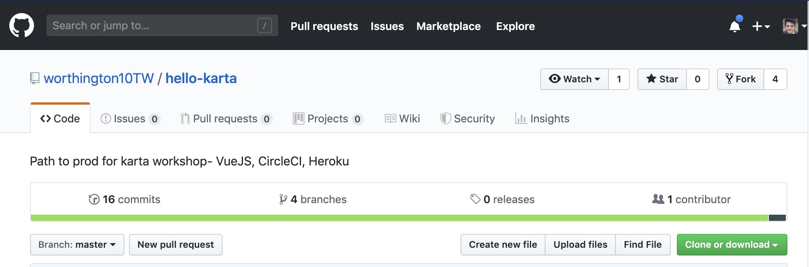
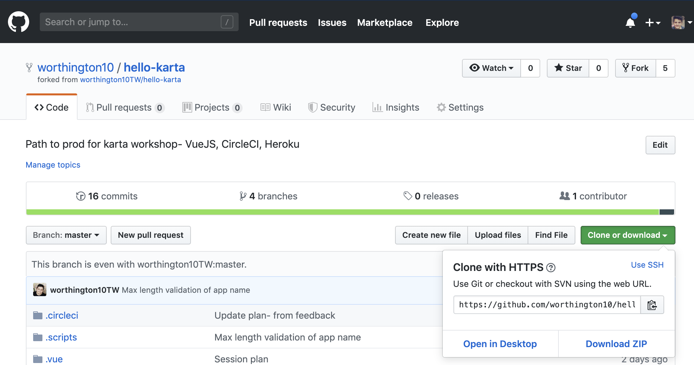
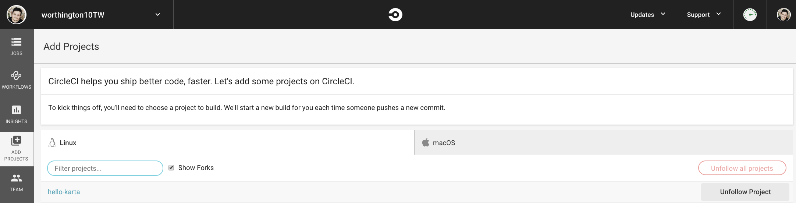
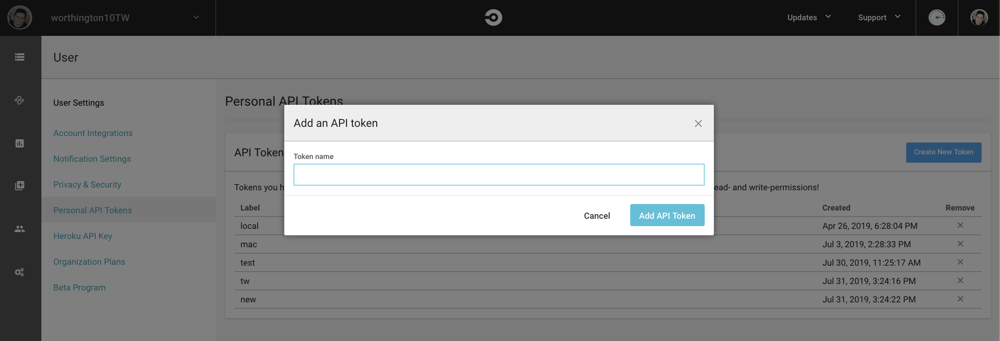
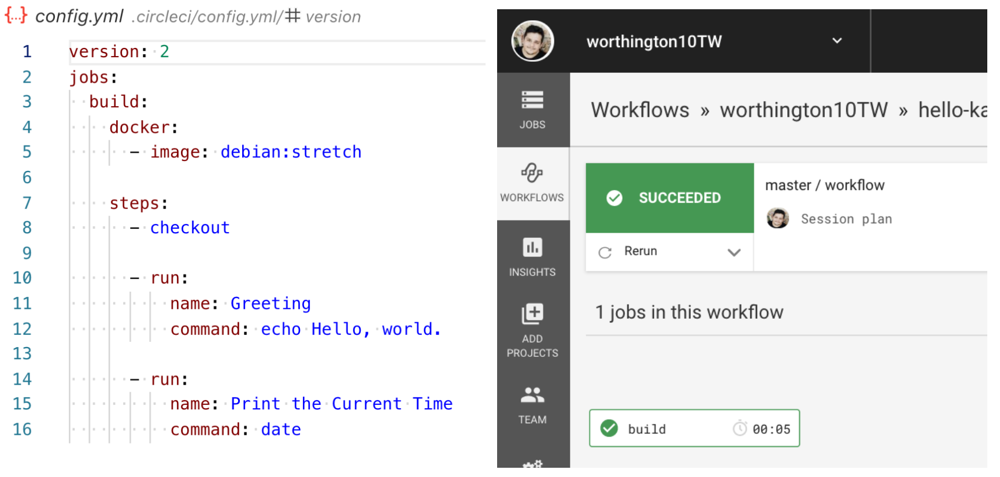
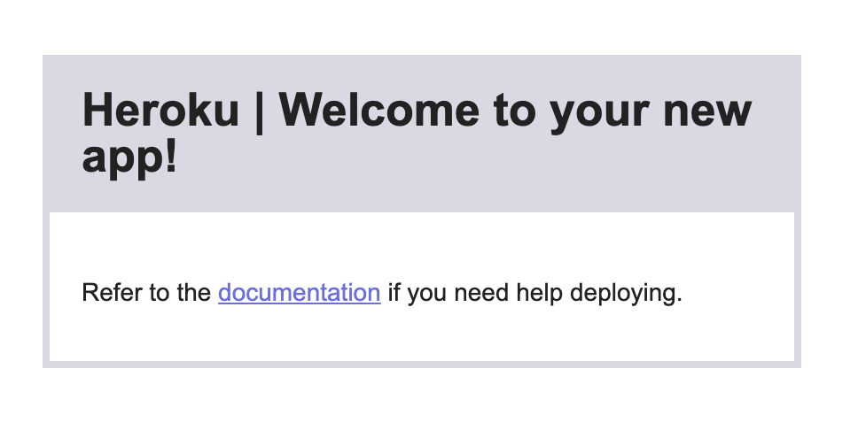

# Get to production!

[https://github.com/worthington10TW/hello-karta](https://github.com/worthington10TW/hello-karta)
Matthew Worthington

Note:

- Developer @ ThoughtWorks
- Twitter: worthington10

---

## What is a CI/CD pipeline?

@ul

- Initiates code builds
- Runs automated tests
- Deploys your code

@ulend

Note:

- A tool to
  - Automate the software delivery process
- -
- Deploying One change, One artefact
- Promoted through a single pipeline, deployed to many environments
- -
- Details
- A CI/CD pipeline helps you automate steps in your software delivery process
- One artefact, promoted through a single pipeline, deployed to many environments
  
---

## Why do we use them?

- Reduce cost of deployment
- Remove manual errors
- Provide standardized feedback loops
- Enable fast product iterations.

Note: 

- Through automation
- increasing delivery confidence and reducing risk

---

## Risk reduction

@ul

- Low-risk releases are incremental
- Decouple deployment and release
- Focus on reducing batch size
- Optimize for resilience

@ulend

Note:

- Architect decouple systems.
  - Independently releasable changes
  - tight coupling == big-bang risky releases.
- Technical decision to deploy != the business decision
  - Dark releases and feature toggles = Continously deploy 
- 10s of lines of code == easier root cause analysis + service restoration
- Failures are inevitable, move towards rapid service restoration
- -
- Details
- Architect our systems so that we can release individual changes independently, tight coupling will lead to big-bang risky releases.
- Separate the technical decision to deploy from the business decision to launch a feature, so we can deploy continuously but release new features on demand. Two commonly-used patterns that enable this goal are dark launching and feature toggles.
- When each deployment consists of tens of lines of code or a few configuration settings, it becomes much easier to perform root cause analysis and restore service in the case of an incident.
- Failures are inevitable, how do we restore service as rapidly as possible when something goes wrong -->

---

## Best practice

@ul

- Only build packages once
- Deploy the same way to every environment
- Smoke test your deployments
- Keep your environments similar

@ulend

Note:

- Same thing we’ve tested throughout the deployment pipeline
  - eliminating the packages as the source of the failure
- We test the deployment process many times before it gets to production
- Running and available as part of the deployment process.
- Same version of the operating system and middleware packages
- -
- Details
- We want to be sure the thing we’re deploying is the same thing we’ve tested throughout the deployment pipeline, eliminating the packages as the source of the failure.
- We test the deployment process many, many times before it gets to production,eliminating it as the source of any problems.
- Make sure your application is running and available as part of the deployment process.
- Keep your environments similar. Same version of the operating system and middleware packages, configured in the same way. This has become much easier to achieve with modern virtualization, container technology and infrastructure as code.

---

## Triggers

@ul

- Code commit
- Scheduled/ CRON
- Manual

@ulend

Note:

- Each change in code triggers an automated build-and-test sequence for the given project, providing feedback to the engineering team
- You may want to run tests constantly over a period or perform cleanup tasks
- In some situations a manual triggered pipeline or stage may be necessary, you may require sign-off from QA or have set release dates

---

## ‘You build it, you run it’ 

@snapend

@fa[rocket fa-5x fa-spin]

---

## 1. Build


---

## 2. Code quality gate


---

## 3. Test automation


---

## 4. Publish


---

## 5. Deploy to staging


---

## 6. Smoke tests


---

## 7. Manual approval


---

## 8. Deplpy to prod


---

## TADA!


---

## What will we be using?


---

## What accounts will I need?


---

## Lets get going

[https://github.com/worthington10TW/hello-karta](https://github.com/worthington10TW/hello-karta)

---

## Validate tools

    ```
    vue --version
    heroku --version
    git --version
    docker --version
    node --version
    npm --version
    curl --version
    ```

---

## Fork



[https://github.com/worthington10TW/hello-karta](https://github.com/worthington10TW/hello-karta)

---

## Clone



---

## Follow



[https://circleci.com](https://circleci.com)

---

## Generate a token



[https://circleci.com/account/api](https://circleci.com/account/api)

---

## You've created your first pipeline!



---

## Create your apps

### And setup env variables

@[2]
@[3]

    ```
    chmod +x ./.scripts/app-builder.sh
    ./.scripts/app-builder.sh [Your app name] [circleCI token]
    ```

@size[14px](*Did it work?? https://dashboard.heroku.com/apps*)
@size[14px](*https://[your-app-name]-staging.herokuapp.com/*)
@size[14px](*https://[your-app-name].herokuapp.com/*)

---

## Did it work?

[https://[your-app-name].herokuapp.com/](https://[your-app-name].herokuapp.com/)
[https://[your-app-name]-staging.herokuapp.com/](https://[your-app-name]-staging.herokuapp.com/)


---

## Create a vue project

@[2]
@[3]

    ```
    cd ..
    vue create --preset ./hello-karta/.vue hello-karta
    ```

@size[14px](*remember to copy package.json from ./.scripts to the root*)

---

## VueJS

@ul

- Simplicity
- Testable
- Flexibility
- Fast and small

@ulend

Note:

- Straightforward template syntax- Handlebars
- Easy to test- mocha/ jest/ jamine
- Component based model- Rich official libraries or make your own
- 30kb, virtual dom- concept same as react

---?image=pitch/plan/VueStructure.png&size=30% auto

Note:

- Main -> App -> Views -> Components

---

## Cheatsheet

@[1]
@[2]
@[3]
@[4]

    npm run serve
    npm run test:unit
    npm run test:e2e
    npm run build

---

## Lets create a pipeline!


---

## Circle CI

- Workflows for job orchestration
- First-class Docker support
- Language-agnostic support

Note:

- Complete control of execution- build, test, deploy
- Docker at its heart
- Supports any language that builds on Linux or macOS

---?image=pitch/plan/Workflows.png&size=30% auto

Note:

- True pipelines
- Fan in and out
- Manually triggers
- Visible feedback
- Branch filtering

---

## Get to staging


---

## Get to prod


---

## NEW REQUIREMENT!!!
