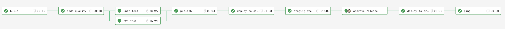

# Path to production

## What are we building?

A path to your own production!


## Why are we building it?

## Stack

- VueJS
- Mocha
- Cypress
- CircleCI
- Heroku
- Powershell/ Bash

## Prerequisites

### Accounts

- GitHub
- Heroku
- CircleCI

### Tools

- Vue CLI
  
  ``` node
  npm install -g @vue/cli
  ```

- Heroku CLI
  
  ``` shell
  brew tap heroku/brew && brew install heroku
  ```

  ``` shell
  sudo snap install --classic heroku
  ```
  
  - [Windows download](https://cli-assets.heroku.com/heroku-x64.exe)
- Circle CLI (optional)
  
  ``` shell
  brew install circleci
  ```

  ``` shell
  curl -fLSs https://circle.ci/cli | bash
  ```

- Git
- Docker
  - [Docker download](https://hub.docker.com/?overlay=onboarding)
- Visual Studio Code (or similar)
- Bash (with cURL) or Poweshell
- Node/ NPM
  - [Node download](https://nodejs.org/en/download/)

## Plan

- [ ] Fork and clone this repo
- [ ] [Watch your repo in CircleCI](https://circleci.com/add-projects)
- [ ] Check out your first pipeline!
- [ ] [Get your API token (keep this safe!)](https://circleci.com/account/api)
- [ ] Run the ./scripts/app-builder.sh [Your app name] [circleCI token]
- [ ] Check out your first Heroku apps!
- [ ] Create your vue project
  
    ``` node
    vue create --preset ./vue [your project name]
    ```

- [ ] Replace this line in package.json

    ``` node
    "test:e2e": "vue-cli-service test:e2e - --headless",
    ```

- [ ] Add this line to package.json

    ``` node
    "test:e2e:no-dev": "vue-cli-service test:e2e - --headless --url ",
    ```

- [ ] Run your project
  
    ``` node
    npm run serve
    ```

- [ ] Unit test your project
  
    ``` node
    npm run test:unit
    ```

- [ ] Run E2e tests
  
    ``` node
    npm run test:e2e
    ```

- [ ] Build your project
  
    ``` node
    npm run build
    ```

- [ ] Dockerize
  
    ``` shell
    docker build -t [your app name] .
    ```

- [ ] Run your app
  
    ``` shell
    docker run -p 5000:5000 [your app name]
    ```

- [ ] Create your pipeline (hint /.scripts)
- [ ] Checkout your staging site!
- [ ] Promote to production
- [ ] We have a new requirement that has come in- Practising TDD techiques implement the following feature.
    > TODO
- [ ] Get your code to production!
- [ ] Take a break.

## Vue cheatsheet

### Project setup

``` node
npm install
```

### Compiles and hot-reloads for development

``` node
npm run serve
```

### Compiles and minifies for production

```  node
npm run build
```

### Run your tests

```  node
npm run test
```

### Lints and fixes files

```  node
npm run lint
```

### Run your end-to-end tests

```  node
npm run test:e2e
```

### Run your unit tests

```  node
npm run test:unit
```
