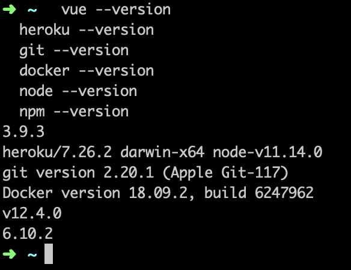

# [Path to production](https://gitpitch.com/worthington10TW/hello-karta/)

## What are we building?

A path to your own production!


## Why are we building it?

A CI/CD pipeline helps you automate steps in your software delivery process, such as initiating code builds, running automated tests, and deploying to a staging or production environment. Automated pipelines remove manual errors, provide standardized feedback loops and enable fast product iterations.

During this session we will create, test, build, run, deploy a VueJS app.

> You build it, you run it.

## Stack

- VueJS
- Mocha
- Cypress
- CircleCI
- Heroku
- Powershell/ Bash

## Prerequisites

Come to the session with your machine ready for action! Sign up and install the bellow.

### Accounts

- GitHub
- Heroku
- CircleCI

### Tools

- Vue CLI
  
  ``` node
  npm install -g @vue/cli
  ```

- Heroku CLI
  
  ``` shell
  brew tap heroku/brew && brew install heroku
  ```

  ``` shell
  sudo snap install --classic heroku
  ```
  
  - [Windows download](https://cli-assets.heroku.com/heroku-x64.exe)
- Circle CLI (optional)
  
  ``` shell
  brew install circleci
  ```

  ``` shell
  curl -fLSs https://circle.ci/cli | bash
  ```

- Git
- Docker
  - [Docker download](https://hub.docker.com/?overlay=onboarding)
- [Visual Studio Code (or similar)](https://code.visualstudio.com/download)
- Bash (with cURL) or Poweshell
  ``` shell
  brew install curl
  ```
- Node/ NPM
  - [Node download](https://nodejs.org/en/download/)

## Validate tools are installed

  ``` shell
  vue --version
  heroku --version
  git --version
  docker --version
  node --version
  npm --version
  curl --version
  ```

The output should look something like this


## Plan

1. Fork and clone this repo
2. [Watch your repo in CircleCI](https://circleci.com/add-projects)
3. Check out your first pipeline!
4. [Get your API token (keep this safe!)](https://circleci.com/account/api)
5. Make the scripts folder executable

    ``` shell
    chmod +x ./.scripts/app-builder.sh
    ```

6. Run the ./scripts/app-builder.sh [Your app name] [circleCI token]
7. Check out your first Heroku apps!
8. Create your vue project
  
    ``` node
    cd .. && vue create --preset ./hello-karta/.vue hello-karta
    ```

9. Replace this line in package.json

    ``` node
    "test:e2e": "vue-cli-service test:e2e - --headless",
    ```

10. Add this line to package.json

    ``` node
    "test:e2e:no-dev": "vue-cli-service test:e2e - --headless --url ",
    ```

11. Run your project
  
    ``` node
    npm run serve
    ```

12. Unit test your project
  
    ``` node
    npm run test:unit
    ```

13. Run E2e tests
  
    ``` node
    npm run test:e2e
    ```

14. Build your project
  
    ``` node
    npm run build
    ```

15. Dockerize
  
    ``` shell
    docker build -t hello-karta .
    ```

16. Run your app
  
    ``` shell
    docker run -p 5000:5000 hello-karta
    ```

17. Create your pipeline (hint /.scripts - ping + setup-heroku)
18. Checkout your staging site!
19. Promote to production
20. We have a new requirement that has come in- Practising TDD techiques implement the following feature.
    > TODO
21. Get your code to production!
22. Take a break.

## Vue cheatsheet

### Project setup

``` node
npm install
```

### Compiles and hot-reloads for development

``` node
npm run serve
```

### Compiles and minifies for production

```  node
npm run build
```

### Run your tests

```  node
npm run test
```

### Lints and fixes files

```  node
npm run lint
```

### Run your end-to-end tests

```  node
npm run test:e2e
```

### Run your unit tests

```  node
npm run test:unit
```
